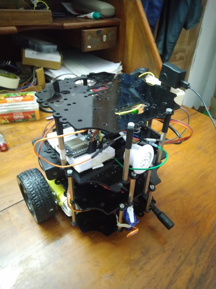
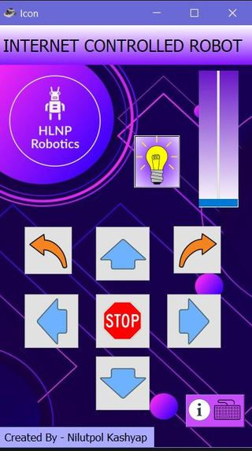
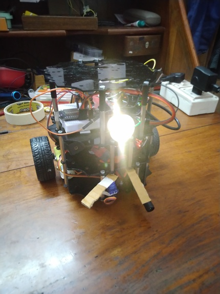
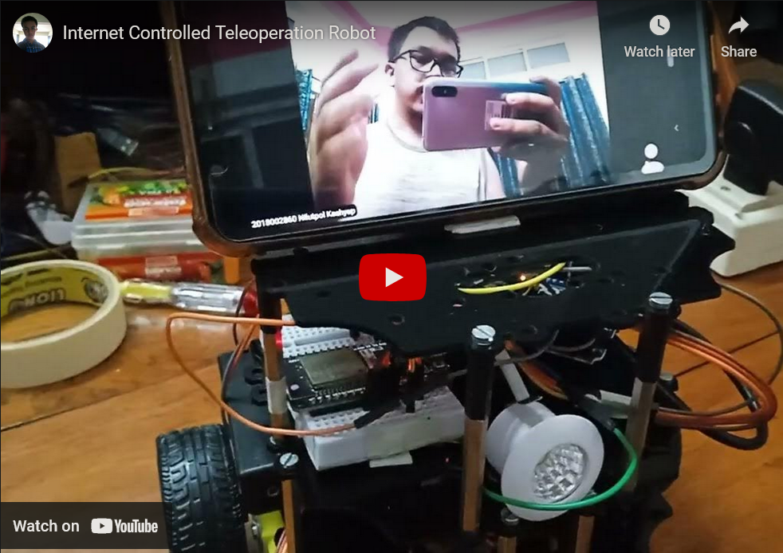

# teleoperation_robot
# Internet Controlled Teleoperation Robot

###  It is a TeleOperation Robot which can be controlled over the internet by anyone having the credentials. 

### We used Firebase Realtime database to send the data from the user to the robot. For the video call solution, we used a old smartphone attached on top of the robot.

## Software Used
- Python
- Arduino Programming
- PyQt5 -> For GUI
- Firebase Realtime Database

## Hardware used 
- ESP32 Dev Board
- Robot Base (Differential drive)
- Smartphone (For Video call)
- Servo Motor (For robot Arm)

## Hardware

 

## GUI

 

## Final Project

 

## Demo Video 

 

## Project Page
[Internet Controlled Teleoperation Robot](https://devpost.com/software/internet-controlled-teleoperation-robot)

## Built By 
- [Nilutpol Kashyap](https://github.com/nilutpolkashyap)
- [Priyanka Kashyap](https://github.com/thepriyankakashyap)
